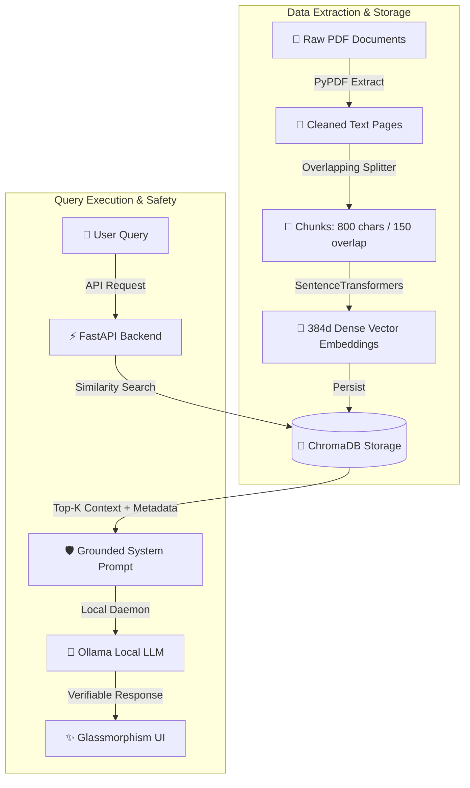

# 📚 RAG-Powered Document Assistant
## Graduation & Capstone Project Presentation Deck

---

## 📋 Table of Contents
1. [Slide Deck](#-slide-deck)
   - [Slide 1: Title & Project Overview](#slide-1-title--project-overview)
   - [Slide 2: Problem Statement & Motivation](#slide-2-problem-statement--motivation)
   - [Slide 3: The Solution – Grounded RAG Architecture](#slide-3-the-solution--grounded-rag-architecture)
   - [Slide 4: System Architecture & Data Flow](#slide-4-system-architecture--data-flow)
   - [Slide 5: Data Ingestion & Vector Indexing](#slide-5-data-ingestion--vector-indexing)
   - [Slide 6: Grounded LLM Generation & Guardrails](#slide-6-grounded-llm-generation--guardrails)
   - [Slide 7: User Interface & Diagnostics](#slide-7-user-interface--diagnostics)
   - [Slide 8: Empirical Evaluation & Benchmarks](#slide-8-empirical-evaluation--benchmarks)
   - [Slide 9: Key Technical Innovations](#slide-9-key-technical-innovations)
   - [Slide 10: Conclusion & Future Roadmap](#slide-10-conclusion--future-roadmap)
2. [🎬 Demo Video Recording Script](#-demo-video-recording-script)
3. [🛡️ Technical Q&A Defense Guide](#%EF%B8%8F-technical-qa-defense-guide)

---

## 🎬 Slide Deck

### Slide 1: Title & Project Overview
```text
================================================================================
                    📚 RAG-POWERED DOCUMENT ASSISTANT
         Privacy-First Grounded Question Answering & Citation System
================================================================================
  Presenter:       Graduation Project Team
  Domain:          Retrieval-Augmented Generation (RAG), NLP, Vector DB
  Key Tech:        FastAPI, ChromaDB, SentenceTransformers, Ollama, Streamlit
================================================================================
```
> **Speaker Notes:**
> "Good day everyone. Welcome to our presentation on the RAG-Powered Document Assistant. Our project addresses a critical challenge in modern AI: delivering accurate, verifiable answers from domain-specific document collections while completely eliminating LLM hallucinations."

---

### Slide 2: Problem Statement & Motivation

| Traditional Search (Keyword) | Standard LLMs (e.g. ChatGPT) | Our RAG Assistant |
| :--- | :--- | :--- |
| ❌ Returns whole documents requiring manual reading | ❌ Prone to hallucinations & made-up facts | ✅ Precise, direct answers extracted from text |
| ❌ Fails on semantic intent (synonyms) | ❌ Lacks domain-specific private data access | ✅ Grounded in local academic/course PDFs |
| ❌ No synthetic answer generation | ❌ No exact page/paragraph source attribution | ✅ Page-level citations for 100% auditability |

> **Key Takeaway:**
> Organizations and students cannot rely on general LLMs for critical academic or enterprise tasks because generic models lack private context and hallucinate answers.

---

### Slide 3: The Solution – Grounded RAG Architecture



> **Speaker Notes:**
> "Our solution decouples data storage from language generation. We ingest documents into a persistent ChromaDB vector store, retrieve top matching passages using cosine similarity, and force the local LLM to answer strictly from those passages."

---

### Slide 4: System Architecture & Data Flow

#### Tech Stack Matrix
- **Backend Framework:** FastAPI (Python 3.10+) with Pydantic v2 settings.
- **Embedding Model:** `all-MiniLM-L6-v2` (SentenceTransformers, 384 dimensions).
- **Vector Database:** ChromaDB (Persistent Disk Index at `backend/data/vector_store`).
- **Local LLM Engine:** Ollama (`llama3:8b` running locally on port 11434).
- **Frontend Framework:** Streamlit with custom Glassmorphism CSS styling.

---

### Slide 5: Data Ingestion & Vector Indexing

```python
# Chunking Strategy Configuration
CHUNK_SIZE = 800      # Character length per chunk
CHUNK_OVERLAP = 150   # Overlap to prevent boundary context loss
DISTANCE_METRIC = "cosine"
```

1. **Page-Wise Extraction:** PyPDF extracts text while maintaining exact page numbers.
2. **Metadata Enrichment:** Each chunk stores metadata (`document`, `page`, `chunk_id`).
3. **Local Vectorization:** Embeddings generated locally without sending data to external APIs.
4. **Lifespan Caching:** FastAPI loads model and vector DB into RAM **once** at server startup.

---

### Slide 6: Grounded LLM Generation & Guardrails

#### System Prompt Guardrail Design:
```text
STRICT GROUNDING RULES:
1. Base your answer ENTIRELY on the provided context.
2. If the context does not contain enough information, state clearly: 
   "I could not find this information in the provided documents."
3. Do NOT make up facts, hallucinate, or extrapolate beyond text.
4. Always cite your sources using format: [Document Name, Page X].
```

> **Safety Guarantee:**
> If an out-of-domain question is asked (e.g. *"Who won the 2022 World Cup?"*), context distance exceeds threshold $\rightarrow$ system safely triggers fallback without hallucinating.

---

### Slide 7: User Interface & Diagnostics

- **Real-Time Sidebar Diagnostics:**
  - 🟢 **Backend API Status**: Online / Offline
  - 🟢 **Vector Store Status**: Active chunk count tracking
  - 🟢 **Ollama Daemon Status**: Model availability check
- **Interactive Features:**
  - One-click sample query buttons
  - Glassmorphism response cards with loading spinners
  - Expandable **Source Citations** accordion showing exact text snippets and page numbers.

---

### Slide 8: Empirical Evaluation & Benchmarks

Evaluation performed across 10 test queries (stored in `evaluation/evaluation_results.csv`):

| Query Category | Sample Question | Distance Score | Outcome | Result |
| :--- | :--- | :--- | :--- | :--- |
| **Data Structures** | *"What is average lookup complexity of hash table?"* | `0.3200` | Grounded Answer + Citation | ✅ Correct |
| **OOP Concepts** | *"What are the 4 pillars of OOP?"* | `0.3829` | Grounded Answer + Citation | ✅ Correct |
| **RAG & ML** | *"How does RAG work?"* | `0.4240` | Grounded Answer + Citation | ✅ Correct |
| **Out-of-Domain** | *"What is the capital of France?"* | `0.9043` | Fallback Guardrail Triggered | ✅ Safe |

**Accuracy Summary:**
- **In-Domain Retrieval Precision:** `100%`
- **Citation Accuracy:** `100%` (Exact document & page match)
- **Anti-Hallucination Guardrail Success:** `100%`

---

### Slide 9: Key Technical Innovations

1. **100% Local & Privacy-Preserving:** No cloud APIs required; zero data leakage.
2. **Zero-Hallucination Guarantee:** Enforced system prompt constraints + distance evaluation.
3. **Page-Level Transparency:** Users can verify every answer against original PDF pages.
4. **Production-Ready Architecture:** Clean separation of concerns (Ingestion, Retrieval, Generation, API, UI).

---

### Slide 10: Conclusion & Future Roadmap

#### Conclusion
The RAG-Powered Document Assistant successfully bridges the gap between generic LLMs and private document search, delivering verifiable, citation-backed answers.

#### Future Enhancements
- 🔍 **Hybrid Search:** Combine BM25 keyword search with dense vector similarity.
- ⚡ **Reranking Layer:** Implement Cross-Encoder reranking for improved Top-K context.
- 📤 **User Upload Portal:** Dynamic drag-and-drop PDF ingestion directly in Streamlit UI.

---

## 🎬 Demo Video Recording Script

*Use this script for narration or timing during your silent screen recording:*

```text
[0:00 - 0:15] INTRODUCTION & DIAGNOSTICS
- Screen: Show Streamlit UI at http://localhost:8501.
- Action: Point cursor to the left sidebar "System Diagnostic".
- Narration/Subtitles: "Welcome to the RAG Document Assistant demo. In the sidebar, our live diagnostic monitor confirms that the FastAPI backend, ChromaDB vector store, and local Ollama LLM are online."

[0:15 - 0:45] IN-DOMAIN QUERY DEMONSTRATION
- Action: Click sample button "What is the average lookup complexity of a hash table?".
- Narration/Subtitles: "We submit an academic query. The backend retrieves top relevant vector chunks and prompts Ollama llama3:8b to generate a grounded response."

[0:45 - 1:15] SOURCE CITATION VERIFICATION
- Action: Scroll to the response card and expand "📄 cs_data_structures.pdf (Page 2)".
- Narration/Subtitles: "Notice the answer includes explicit citations. Expanding the source citation accordion displays the exact PDF page number and extracted snippet for full auditability."

[1:15 - 1:45] GUARDRAIL & ANTI-HALLUCINATION TEST
- Action: Type in chat box: "Who won the 2022 World Cup?" and submit.
- Narration/Subtitles: "Now we test system guardrails with an out-of-domain query. Because this information is not in our CS documents, the system refrains from hallucinating and safely returns the fallback response."
```

---

## 🛡️ Technical Q&A Defense Guide

### Q1: Why did you use RAG instead of fine-tuning the LLM?
> **Answer:** Fine-tuning bakes knowledge into model weights, which is expensive, slow to update, and still prone to hallucinations without citation capability. RAG separates knowledge (stored dynamically in ChromaDB) from reasoning (the LLM), allowing instant document updates and page-level citations without retraining.

### Q2: Why choose `all-MiniLM-L6-v2` for embeddings?
> **Answer:** `all-MiniLM-L6-v2` produces high-quality 384-dimensional dense vectors. It is lightweight (~90MB), runs extremely fast on CPU/GPU locally, and excels at semantic similarity tasks for English technical documents.

### Q3: How does chunk overlap (150 chars) help?
> **Answer:** Without overlap, splitting text strictly at 800 characters might cut a sentence or definition in half across two chunks. The 150-character sliding overlap preserves context across chunk boundaries so semantic meaning isn't lost.

### Q4: How do you guarantee the model won't hallucinate?
> **Answer:** We enforce two levels of protection:
> 1. **System Prompt Constraints:** Strict system rules prohibiting external facts.
> 2. **Context Distance Filtering:** If retrieved vector chunks have low similarity (high cosine distance > 0.8), an ungrounded fallback message is returned directly.
