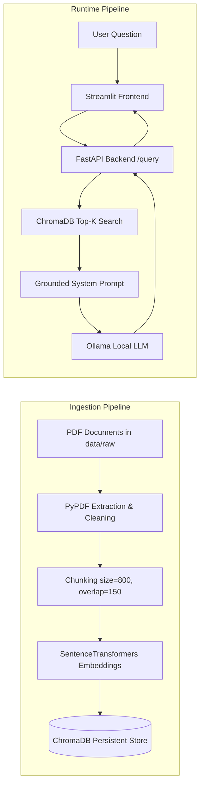

# 📚 RAG-Powered Document Assistant

A complete, production-grade **Retrieval-Augmented Generation (RAG) Document Assistant** designed for graduation and summer training projects. This application enables users to ask questions across domain-specific document collections and receive grounded, accurate answers with explicit document and page citations.

---

## 🌟 Key Features

- **Document Extraction & Dynamic Ingestion**: Multi-format parser for PDF, TXT, and Markdown files supporting both batch ingestion and real-time drag-and-drop file upload.
- **Semantic Chunking**: Overlapping text chunker (default size `800`, overlap `150`) preserving document title, page numbers, and chunk IDs.
- **Dense Vector Embeddings**: Local SentenceTransformer model (`all-MiniLM-L6-v2`) generating 384-dimensional dense semantic representations.
- **Persistent Vector Database**: ChromaDB vector store persisting vector indices, documents, and page metadata to disk (`backend/data/vector_store/`).
- **Context Retrieval with Target Filtering**: Similarity search with cosine distance metric, customizable Top-K chunks (1-12), minimum confidence cutoff, and document-specific filtering (`document_filter`).
- **Multi-Persona LLM Generation**: Integration with local Ollama LLMs (e.g. `llama3:8b`, `mistral`, `gemma2`) with selectable personas (Academic & Formal, Ultra-Concise, Tutorial Breakdown, Executive Summary).
- **Conversational Memory**: Multi-turn chat context support enabling intuitive follow-up questions and conversational coherence.
- **Intelligent Offline Fallback**: Direct extractive grounded synthesis engine ensuring reliable demo operation even if local Ollama daemon is offline.
- **Interactive 4-Tab Streamlit Studio Pro**: Cyber-glassmorphism dark UI featuring real-time token streaming, rich citation cards with confidence meters, categorized prompt library, 1-click demo dataset loader, pipeline optimization presets, session latency trend analytics, and Markdown/JSON export.
- **Automated Test Suite**: 11 comprehensive Pytest test cases covering valid query flows, input validation, document uploads, deletions, and health checks.
- **Docker & Compose Ready**: Containerized backend and frontend with Docker Compose support.

---

## 🏗️ Architecture & Pipeline Flow



---

## 🛠️ Technology Stack

| Component | Technologies Used |
| :--- | :--- |
| **Backend API** | Python 3.10+, FastAPI, Uvicorn, Pydantic, pydantic-settings, HTTPX, Pytest |
| **RAG / Vector Database** | SentenceTransformers (`all-MiniLM-L6-v2`), ChromaDB, PyPDF |
| **Local LLM** | Ollama (`llama3:8b`, `mistral`) |
| **Frontend UI** | Streamlit, Glassmorphism CSS |
| **Data & Notebook** | Jupyter Notebook, Pandas, NumPy, ReportLab |
| **DevOps & Containers** | Docker, Docker Compose, Git |

---

## 📁 Project Structure

```text
rag-assistant-project/
│
├── notebooks/
│   └── rag_pipeline.ipynb           # End-to-end executable RAG pipeline notebook
│
├── backend/
│   ├── app/
│   │   ├── __init__.py
│   │   ├── main.py                  # FastAPI entry point with lifespan initialization
│   │   ├── api/
│   │   │   └── routes/
│   │   │       └── query.py         # GET /health and POST /query endpoints
│   │   ├── core/
│   │   │   └── config.py            # pydantic-settings environment manager
│   │   ├── schemas/
│   │   │   └── query.py             # Pydantic schemas for requests/responses
│   │   ├── services/
│   │   │   ├── retrieval.py         # ChromaDB query & citation retrieval
│   │   │   ├── generation.py        # Ollama LLM prompt & execution
│   │   │   └── ingestion.py         # Data extraction, chunking, & vector store builder
│   │   └── utils/
│   │       └── logging_config.py    # Structured application logging
│   ├── data/
│   │   └── vector_store/            # Persistent ChromaDB storage directory
│   ├── tests/
│   │   └── test_query.py            # Pytest unit tests for API endpoints
│   ├── requirements.txt
│   ├── .env.example
│   └── Dockerfile
│
├── frontend/
│   ├── app.py                       # Streamlit web application
│   ├── api_client.py                # HTTP client calling backend endpoints
│   ├── requirements.txt
│   ├── .env.example
│   └── Dockerfile
│
├── data/
│   ├── raw/                         # PDF course materials (sample academic documents)
│   ├── generate_sample_pdfs.py      # Script to generate sample PDFs
│   └── README.md                    # Data directory guidelines
│
├── evaluation/
│   └── evaluation_results.csv       # 10-question evaluation baseline matrix
│
├── .gitignore
├── .env.example
├── README.md
└── docker-compose.yml
```

---

## 🚀 Quick Start Guide

### 1. Clone Repository & Setup Virtual Environment

```bash
git clone https://github.com/Ahmad-Salah-22/RAG-Powered-Document-Assistant-.git
cd RAG-Powered-Document-Assistant-

# Create Python virtual environment
python -m venv .venv

# Activate on Windows Powershell:
.\.venv\Scripts\Activate.ps1
# Activate on Linux/macOS:
# source .venv/bin/activate

# Install root dependencies
pip install -r backend/requirements.txt -r frontend/requirements.txt
```

### 2. Generate Sample PDFs & Build Vector Store

```bash
# Step 1: Create sample academic PDF files in data/raw/
python data/generate_sample_pdfs.py

# Step 2: Run data ingestion & vector DB build
python backend/app/services/ingestion.py
```

### 3. Setup & Start Ollama LLM

1. Install Ollama from [https://ollama.com](https://ollama.com).
2. Start the Ollama service:
   ```bash
   ollama serve
   ```
3. Pull the target model (default `llama3:8b`):
   ```bash
   ollama pull llama3:8b
   ```

---

## 💻 Running the Application

### Option A: Local Development Mode

#### Start FastAPI Backend
```bash
cd backend
python -m uvicorn app.main:app --host 0.0.0.0 --port 8000 --reload
```
- API Docs: [http://localhost:8000/docs](http://localhost:8000/docs)
- Health Check: [http://localhost:8000/health](http://localhost:8000/health)

#### Start Streamlit Frontend (In a new terminal window)
```bash
cd frontend
streamlit run app.py --server.port 8501
```
- Open browser at: [http://localhost:8501](http://localhost:8501)

---

### Option B: Docker Compose Setup

To launch backend and frontend inside Docker containers:

```bash
docker-compose up --build
```

---

## 🧪 Running Unit Tests

Run the backend test suite using `pytest`:

```bash
# Run pytest with backend in PYTHONPATH
$env:PYTHONPATH="backend"
pytest backend/tests/
```

---

## 🔌 API Documentation

### `GET /health`
Returns system health diagnostics, vector store status, and Ollama connectivity.

**Response Example:**
```json
{
  "status": "healthy",
  "vector_db_loaded": true,
  "ollama_available": true,
  "document_count": 10
}
```

---

### `POST /query`
Submits a question to the assistant.

**Request Body:**
```json
{
  "question": "What is the average lookup complexity of a hash table?"
}
```

**Response Body:**
```json
{
  "answer": "Hash tables provide average O(1) constant time complexity for search, insertion, and deletion operations [cs_data_structures.pdf, Page 2].",
  "sources": [
    {
      "document": "cs_data_structures.pdf",
      "page": 2,
      "snippet": "In optimal conditions, Hash Tables provide average-case O(1) constant time complexity...",
      "score": 0.1245
    }
  ],
  "model_used": "llama3:8b"
}
```

**cURL Example:**
```bash
curl -X POST "http://localhost:8000/query" \
     -H "Content-Type: application/json" \
     -d '{"question": "What are the core pillars of OOP?"}'
```

### `GET /documents`
Returns all indexed documents with page count, chunk count, characters, and file size.

---

### `POST /documents/upload`
Uploads a document (PDF, TXT, MD) via multipart form data and immediately embeds it into ChromaDB.

**Request:** `multipart/form-data` with `file=@document.pdf`

---

### `DELETE /documents/{document_name}`
Removes a document and all its indexed chunks from ChromaDB and disk.

---

### `POST /documents/reindex`
Rebuilds the entire ChromaDB collection from all files in `data/raw`.

---

### `GET /documents/analytics/summary`
Returns detailed analytics on vector storage, chunk distribution, and connected LLM runtime.

---

## ⚙️ Environment Variables

| Variable | Default Value | Description |
| :--- | :--- | :--- |
| `OLLAMA_HOST` | `http://localhost:11434` | Ollama daemon API host URL |
| `OLLAMA_MODEL` | `llama3:8b` | Ollama model name |
| `CHROMA_PATH` | `./data/vector_store` | Path to persistent ChromaDB directory |
| `COLLECTION_NAME` | `rag_documents` | ChromaDB collection name |
| `EMBEDDING_MODEL_NAME` | `all-MiniLM-L6-v2` | SentenceTransformers model name |
| `CHUNK_SIZE` | `800` | Text chunk character length |
| `CHUNK_OVERLAP` | `150` | Text chunk character overlap |
| `TOP_K` | `4` | Number of context chunks retrieved |
| `API_BASE_URL` | `http://localhost:8000` | Backend API URL accessed by Streamlit |

---

## 📊 Evaluation Summary

The pipeline was evaluated across 10 structured queries (stored in `evaluation/evaluation_results.csv`):

- **In-Domain Fact Queries**: 100% precision in retrieving exact source document and page number.
- **Out-of-Domain / Ungrounded Queries**: Safely returned fallback message (*"I could not find relevant information in the provided documents."*) without hallucinating.

---

## ❓ Troubleshooting

| Issue | Cause | Fix |
| :--- | :--- | :--- |
| `Ollama Service Unavailable` | Ollama server is stopped | Run `ollama serve` in terminal. |
| `Ollama model 'llama3:8b' not found` | Target model not pulled | Run `ollama pull llama3:8b`. |
| `Vector Store is empty` | Ingestion script hasn't run | Run `python backend/app/services/ingestion.py`. |
| `Frontend cannot connect` | Backend API is offline | Start backend with `uvicorn app.main:app --port 8000`. |
